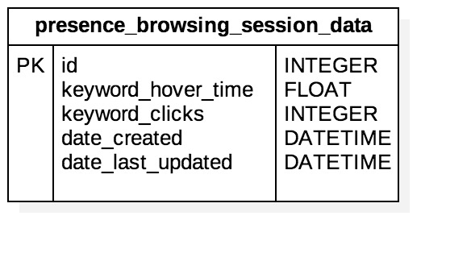

# Browsing Session Data HTTP REST Endpoint README - Presence Health



## IN TEST
## Browsing Session Data: Read Method Endpoint
- To read/query rows in the presence_browsing_session_data table of the database, make a GET request to
http://patient-assist-backend.herokuapp.com/v1/presence_health/browsing_session_data/
    - Results returned in the response body will be filtered by the parameters given in the query string of the request url.
    - The parameters given in the query string can be divided into 2 categories: "primary" and "secondary"
    
    - "primary" parameters - One and exactly one of these parameters are required in every request query string.
        - "id" corresponds to the id column of the presence_browsing_session_data table.
            - Must be an integer
            - Can be multiple values separated by commas.
            - passing "all" as the value will return all presence_browsing_intent_snapshot rows.
            
    - "Secondary" parameters - Any number of these parameters can be added to a request query string.
        - "'keyword'_clicks" corresponds to the minimum value for the 'keyword'_clicks column of the
        presence_browsing_session_data table where 'keyword' is the corresponding intent keyword.
            - Must be an integer.
        - "'keyword'_hover_time" corresponds to the minimum value for the 'keyword'_hover_time column of the
        presence_browsing_session_data table where 'keyword' is the corresponding intent keyword.
            - Must be a float.
        - "min_date" - Minimum date for the date_created column of the presence_browsing_session_data table
            - Must be given in "YYYY-MM-DD" format
        - "max_date" - Maximum date for the date_created column of the presence_browsing_session_data table
            - Must be given in "YYYY-MM-DD" format
        - "has_presence_conversation_workflow_snapshot" corresponds to whether a row in the presence_browsing_session_data table
        has a relation to any rows of the presence_conversation_workflow_snapshot table.
            - IN DEVELOPMENT
            - must be of type boolean (true or false)
    
- The response body will be JSON formatted text with the following format:
    ```
    {
        "Data": [
            {
                "keyword_clicks": Integer,
                "keyword'_hover_time": Float,
                'current_intent': String,
                "id": Integer,
            },
            ...,
            ...,
            ...,
        ],
        "purchased_cases_for_this_time_period": Integer,
        "Status": {
            "Version": 1.0,
            "Error Code": Integer,
            "Errors": Array
        }
    }
    ```
  
- If there ARE NO errors parsing the request body and rows in the presence_browsing_session_data table of the database ARE found:
    - The value for the "Errors" key in the response root object will an empty array
    - The value for the "Error Code" key in the response root object will be 0. 
- If there ARE errors parsing the request body or rows in the presence_browsing_session_data table of the database ARE NOT found,
    - "Error Code" will be 1.
    - An array of length > 0 will be the value for the "Errors" key in the "Status" object.
        -Each item in the array is a string corresponding to an error parsing the JSON Body doc.
    - An empty array will be the value for the "Data" key.