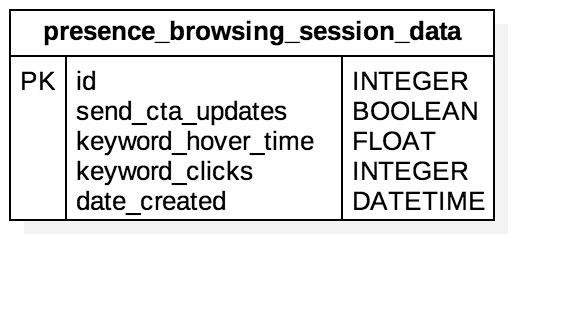

# Browsing Session Data WAMP Server API README  - Presence Health
### The websocket uri for the WAMP server is: ws://patient-assist-backend.herokuapp.com/ws
### All WAMP components/enpoints are in the realm: patient_assist_realm



## [Current list of intent keywords](http://picbackend.herokuapp.com/v2/cta/?intent=all)

## Procedure Endpoint: Create row in the presence_browsing_session_data table
## URI: patient_assist_backend.presence_health.create_browsing_data_instance
    ```
    This procedure creates a new row in the presence_browsing_session_data table of the database and returns the db id and cookie_id of the
    newly created entry.
    
    Procedure uri: 'patient_assist_backend.presence_health.create_browsing_data_instance'
    
    Takes no params
      
    :return: Returns an object that has a property, kwargs. That property will have the following properties:
            id: (type: Integer) Database id of newly created presence health browsing data row
            cookie_id: (type: String) Cookie id of newly created presence health browsing data row
    ```

- Example Javascript Call
    ```
    <!DOCTYPE html>
    <html>
       <body>
          <h1>Example Client Side Calls to Patient Assist Backend</h1>
          <p>Open JavaScript console to watch output.</p>
          <script src="https://autobahn.s3.amazonaws.com/autobahnjs/latest/autobahn.min.jgz"></script>
          <script>
          try {
               var autobahn = require('autobahn');
               var when = require('when');
            } catch (e) {
               // When running in browser, AutobahnJS will
               // be included without a module system
               var when = autobahn.when;
            }
            
            var wsuri = "ws://patient-assist-backend.herokuapp.com/ws";
            var connection = new autobahn.Connection({
                               url: wsuri,
                               realm: 'patient_assist_realm'}
                            );
                            
            connection.onopen = function (session) {
               var dl = [];
            
               dl.push(session.call('patient_assist_backend.presence_health.create_browsing_data_instance').then(
                  function (res) {
                     console.log("Result: DB ID:" + res.kwargs.id + ", Cookie ID: " + res.kwargs.cookie_id);
                  }
               ));
            
               when.all(dl).then(function () {
                  console.log("All finished.");
                  connection.close();
               });
            };
            
            connection.open();
          </script>
       </body>
    </html>
    ```

### IN DEVELOPMENT
## Procedure Endpoint: Read row from presence_browsing_session_data table of the database
## URI: patient_assist_backend.presence_health.read_presence_browsing_session_data_table
    ```
    This procedure reads/queries the presence_browsing_session_data table of the database for a row that has a matching
    value in the id field for the given id parameter.
    
    Procedure uri: 'patient_assist_backend.presence_health.read_presence_browsing_session_data_table'
    
    :param args: Argument list. Accepts only one argument
                 [id]
                 id: (type: Integer) Database id of desired row.
      
    :return: Returns an object that has a property, kwargs. That property will have the following properties:
             id: (type: Integer) id of presence_browsing_session_data row
             keyword_clicks: (type: Integer) number of clicks corresponding to given keyword
             keyword_hover_time: (type: Float) length of hover time corresponding to given keyword
    ```

- Example Javascript Call
    ```
    <!DOCTYPE html>
    <html>
       <body>
          <h1>Example Client Side Calls to Patient Assist Backend</h1>
          <p>Open JavaScript console to watch output.</p>
          <script src="https://autobahn.s3.amazonaws.com/autobahnjs/latest/autobahn.min.jgz"></script>
          <script>
          try {
               var autobahn = require('autobahn');
               var when = require('when');
            } catch (e) {
               // When running in browser, AutobahnJS will
               // be included without a module system
               var when = autobahn.when;
            }
            
            var wsuri = "ws://patient-assist-backend.herokuapp.com/ws";
            var connection = new autobahn.Connection({
                               url: wsuri,
                               realm: 'patient_assist_realm'}
                            );
                            
            connection.onopen = function (session) {
               var dl = [];
               var id = 1;
            
               dl.push(session.call('patient_assist_backend.presence_health.read_presence_browsing_session_data_table', [id]).then(
                  function (res) {
                     console.log("Result: DB ID:" + res.kwargs.id + ", keyword_clicks: " + res.kwargs.keyword_clicks + ", keyword_hover_time: " + res.kwargs.keyword_hover_time);
                  }
               ));
            
               when.all(dl).then(function () {
                  console.log("All finished.");
                  connection.close();
               });
            };
            
            connection.open();
          </script>
       </body>
    </html>
    ```
    
### IN DEVELOPMENT
## Procedure Endpoint: Read current browsing intent of row from presence_browsing_session_data table of the database
## URI: patient_assist_backend.presence_health.read_current_browsing_intent
    ```
    This procedure calculates and returns the current browsing intent of a row in the presence_browsing_session_data
    table of the database for the given id parameter.
    
    Procedure uri: 'patient_assist_backend.presence_health.read_current_browsing_intent'
    
    :param args: Argument list. Accepts only one argument
                 [id]
                 id: (type: Integer) Database id of desired row.
      
    :return: Returns an object that has a property, kwargs. That property will have the following properties:
             id: (type: Integer) id of presence_browsing_session_data row
             current_intent: (type: String) current browsing intent of given row
             cta_url: (type: String) URL for Call to Action for current browsing intent
    ```

- Example Javascript Call
    ```
    <!DOCTYPE html>
    <html>
       <body>
          <h1>Example Client Side Calls to Patient Assist Backend</h1>
          <p>Open JavaScript console to watch output.</p>
          <script src="https://autobahn.s3.amazonaws.com/autobahnjs/latest/autobahn.min.jgz"></script>
          <script>
          try {
               var autobahn = require('autobahn');
               var when = require('when');
            } catch (e) {
               // When running in browser, AutobahnJS will
               // be included without a module system
               var when = autobahn.when;
            }
            
            var wsuri = "ws://patient-assist-backend.herokuapp.com/ws";
            var connection = new autobahn.Connection({
                               url: wsuri,
                               realm: 'patient_assist_realm'}
                            );
                            
            connection.onopen = function (session) {
               var dl = [];
               var id = 1;
            
               dl.push(session.call('patient_assist_backend.presence_health.read_current_browsing_intent', [id]).then(
                  function (res) {
                     console.log("Result: DB ID:" + res.kwargs.id + ", current_intent: " + res.kwargs.current_intent + ", cta_url: " + res.kwargs.cta_url);
                  }
               ));
            
               when.all(dl).then(function () {
                  console.log("All finished.");
                  connection.close();
               });
            };
            
            connection.open();
          </script>
       </body>
    </html>
    ```
    
## Procedure Endpoint: Submit Browsing Data Information for Presence Health
## URI: patient_assist_backend.presence_health.submit_browsing_data
    ```
    This procedure takes a given cookie_id corresponding to a row in the presence_browsing_session_data table along with
    client browsing data information, updates the row with that info, and returns relevant updated field data from that
    row.
    
    Procedure uri: 'patient_assist_backend.presence_health.submit_browsing_data'
    
    :param args: Argument list. Accepts only one argument
                 [browsing_data_json]
                 browsing_data_json: A JSON formatted object that has the following mandatory keys
                                     cookie_id: (type: String) Cookie id of presence health browsing data row
                                     keyword: (type: String) name corresponding the given browsing data. Currently only accepts 'oncology'
                                     keyword_clicks: (type: Integer) number of clicks corresponding to given keyword
                                     keyword_hover_time: (type: Float) length of hover time corresponding to given keyword
    :return: Returns an object that has a property, kwargs. That property will have the following properties:
            id: (type: Integer) Database id of newly created presence health browsing data row
            cookie_id: (type: String) Cookie id of newly created presence health browsing data row
            oncology_clicks: (type: Integer) Total number of clicks corresponding to the 'oncology' keyword
            oncology_hover_time: (type: Float) Total amount of time corresponding to the 'oncology' keyword
            
    Possible Errors:
    'patient_assist_backend.submit_browsing_data_presence_health' accepts exactly 1 argument, browsing data.
    browsing data must be a unicode objector string object.
    Decoding browsing data JSON has failed
    No Presence Health Browsing data entry found for cookie_id
    More than one Presence Health Browsing data entry found for cookie_id
    'cookie_id' must be a unicode or string object
    'cookie_id' key is not present in browsing data JSON object.
    'keyword' must be a unicode or string object.
    'keyword' must be in the following list of accepted keywords: ['oncology', etc.]
    'keyword' key is not present in browsing data JSON object.
    'keyword_clicks' must be an integer.
    'keyword_clicks' must be an positive.
    'keyword_clicks' key is not present in browsing data JSON object.
    'keyword_hover_time' must be a floating point.
    'keyword_hover_time' must be positive
    'keyword_hover_time' key is not present in browsing data JSON object.
    
    ```

- Example Javascript Call
    ```
    <!DOCTYPE html>
    <html>
       <body>
          <h1>Example Client Side Calls to Patient Assist Backend</h1>
          <p>Open JavaScript console to watch output.</p>
          <script src="https://autobahn.s3.amazonaws.com/autobahnjs/latest/autobahn.min.jgz"></script>
          <script>
          try {
               var autobahn = require('autobahn');
               var when = require('when');
            } catch (e) {
               // When running in browser, AutobahnJS will
               // be included without a module system
               var when = autobahn.when;
            }
            
            var wsuri = "ws://patient-assist-backend.herokuapp.com/ws";
            var connection = new autobahn.Connection({
                               url: wsuri,
                               realm: 'patient_assist_realm'}
                            );
                            
            connection.onopen = function (session) {
               var dl = [];
            
               var browsing_data_obj = {"cookie_id": 16,
                                        "keyword": "oncology",
                                        "keyword_clicks": 2,
                                        "keyword_hover_time": 3.2};
               dl.push(session.call('patient_assist_backend.presence_health.submit_browsing_data', [JSON.stringify(browsing_data_obj)]).then(
                  function (res) {
                     console.log("Result: clicks:" + res.kwargs.oncology_clicks + ", hover time: " + res.kwargs.oncology_hover_time);
                  },
                  function (err) {
                     console.log("Error:", err.error, err.args, err.kwargs);
                  }
               ));
            
               when.all(dl).then(function () {
                  console.log("All finished.");
                  connection.close();
               });
            };
            
            connection.open();
          </script>
       </body>
    </html>
    ```

### The Following 3 Endpoints Will Soon Be Depricated
## Procedure: Enable CTA Updates for a Presence Health Browsing Data Instance
## URI: patient_assist_backend.presence_health.enable_cta_updates
    ```
    This procedure takes a given cookie_id corresponding to a presence health browsing data db row and sets its
    send_cta_updates value to True. When a given browsing data's instance is set to True, it will publish the URL
    for the most updated CTA for a given browsing data instance at uri 
    'patient_assist_backend.presence_health.new_ctas.<cookie_id>'.
    
    Procedure uri: 'patient_assist_backend.presence_health.enable_cta_updates'
    
    :param args: Argument list. Accepts only one argument
                 [cookie_id]
                 cookie_id: (type: String) Cookie id of presence health browsing data.
    :return: Returns an object that has a property, kwargs. That property will have the following properties:
            id: (type: Integer) Database id of newly created presence health browsing data row
            cookie_id: (type: String) Cookie id of newly created presence health browsing data row
            sending_browsing_data: (type: Boolean) Whether or not updated CTA's are being published for this entry.
            
    Possible Errors:
    function accepts exactly 1 positional argument, cookie_id.
    cookie_id must be a unicode or string object
    No Presence Health Browsing data entry found for cookie_id
    More than one Presence Health Browsing data entry found for cookie_id
    
    ```

- Example Javascript Call
    ```
    <!DOCTYPE html>
    <html>
       <body>
          <h1>Example Client Side Calls to Patient Assist Backend</h1>
          <p>Open JavaScript console to watch output.</p>
          <script src="https://autobahn.s3.amazonaws.com/autobahnjs/latest/autobahn.min.jgz"></script>
          <script>
          try {
               var autobahn = require('autobahn');
               var when = require('when');
            } catch (e) {
               // When running in browser, AutobahnJS will
               // be included without a module system
               var when = autobahn.when;
            }
            
            var wsuri = "ws://patient-assist-backend.herokuapp.com/ws";
            var connection = new autobahn.Connection({
                               url: wsuri,
                               realm: 'patient_assist_realm'}
                            );
               
            var cookie_id = localStorage.getItem("pic_patient_assist_cookie_id");
            
            connection.onopen = function (session) {
               var dl = [];
            
               dl.push(session.call('patient_assist_backend.presence_health.enable_cta_updates', [cookie_id]).then(
                  function (res) {
                     console.log("Result: Cookie ID:" + res.kwargs.cookie_id + ", Sending Browsing Data?: " + res.kwargs.sending_browsing_data);
                  },
                  function (err) {
                     console.log("Error:", err.error, err.args, err.kwargs);
                  }
               ));
            
               when.all(dl).then(function () {
                  console.log("All finished.");
                  connection.close();
               });
            };
            
            connection.open();
          </script>
       </body>
    </html>
    ```

## Procedure: Disable CTA Updates for a Presence Health Browsing Data Instance 
## URI: patient_assist_backend.presence_health.disable_cta_updates
    ```
    This procedure takes a given cookie_id corresponding to a presence health browsing data db row and sets its
    send_cta_updates value to True. When a given browsing data's instance is set to False, it will NOT publish the URL
    for the most updated CTA until set back to True.
    
    Procedure uri: 'patient_assist_backend.presence_health.disable_cta_updates'
    
    :param args: Argument list. Accepts only one argument
                 [cookie_id]
                 cookie_id: (type: String) Cookie id of presence health browsing data.
    :return: Returns an object that has a property, kwargs. That property will have the following properties:
            id: (type: Integer) Database id of newly created presence health browsing data row
            cookie_id: (type: String) Cookie id of newly created presence health browsing data row
            sending_browsing_data: (type: Boolean) Whether or not updated CTA's are being published for this entry.
            
    Possible Errors:
    function accepts exactly 1 positional argument, cookie_id.
    cookie_id must be a unicode or string object
    No Presence Health Browsing data entry found for cookie_id
    More than one Presence Health Browsing data entry found for cookie_id
    
    ```

- Example Javascript Call
    ```
    <!DOCTYPE html>
    <html>
       <body>
          <h1>Example Client Side Calls to Patient Assist Backend</h1>
          <p>Open JavaScript console to watch output.</p>
          <script src="https://autobahn.s3.amazonaws.com/autobahnjs/latest/autobahn.min.jgz"></script>
          <script>
          try {
               var autobahn = require('autobahn');
               var when = require('when');
            } catch (e) {
               // When running in browser, AutobahnJS will
               // be included without a module system
               var when = autobahn.when;
            }
            
            var wsuri = "ws://patient-assist-backend.herokuapp.com/ws";
            var connection = new autobahn.Connection({
                               url: wsuri,
                               realm: 'patient_assist_realm'}
                            );
                            
            var cookie_id = localStorage.getItem("pic_patient_assist_cookie_id");
            
            connection.onopen = function (session) {
               var dl = [];
            
               dl.push(session.call('patient_assist_backend.presence_health.disable_cta_updates', [cookie_id]).then(
                  function (res) {
                     console.log("Result: Cookie ID:" + res.kwargs.cookie_id + ", Sending Browsing Data?: " + res.kwargs.sending_browsing_data);
                  },
                  function (err) {
                     console.log("Error:", err.error, err.args, err.kwargs);
                  }
               ));
            
               when.all(dl).then(function () {
                  console.log("All finished.");
                  connection.close();
               });
            };
            
            connection.open();
          </script>
       </body>
    </html>
    ```

## Updated CTA WAMP Subscription Topic
## URI: patient_assist_backend.presence_health.new_ctas.<cookie_id>

- Current Algorithm:
    - each intent keyword has an "intent index"= 10*(clicks) + hover time
    - intent keyword with the highest non zero intent index is returned
    - if no intent keywords have an "intent index">0, default cta is returned
    
- Alternate Algorithm (Returns intent keyword that fulfills first criteria applicable of the following list):
    - intent keyword with the highest non zero clicks
    - intent keyword with the highest non zero hover time
    - if no intent keywords have non zero clicks or hover time, default cta is returned

- When you subscribe to this topic, the url for the most updated CTA of the corresponding cookie_id will be published
  iff the sending_cta_updates value is set to TRUE,
  - When a subscription event is published, the result can be accessed through the keyword argument, cta_url
  
- Example Javascript call:
    ```
    <!DOCTYPE html>
    <html>
       <body>
          <h1>Example Client Side Calls to Patient Assist Backend</h1>
          <p>Open JavaScript console to watch output.</p>
          <script src="https://autobahn.s3.amazonaws.com/autobahnjs/latest/autobahn.min.jgz"></script>
          <script>
          try {
               var autobahn = require('autobahn');
               var when = require('when');
            } catch (e) {
               // When running in browser, AutobahnJS will
               // be included without a module system
               var when = autobahn.when;
            }
            
            var wsuri = "ws://patient-assist-backend.herokuapp.com/ws";
            var connection = new autobahn.Connection({
                               url: wsuri,
                               realm: 'patient_assist_realm'}
                            );
               
            var cookie_id = localStorage.getItem("pic_patient_assist_cookie_id");
            
            connection.onopen = function (session) {
               function onevent1(args, kwargs) {
                  console.log("Result: call to action url:" + kwargs.cta_url);
               }
            
               var sub_url = 'patient_assist_backend.presence_health.new_ctas.' + cookie_id;
               console.log(sub_url);
               session.subscribe(sub_url, onevent1);
            };
            
            connection.open();
          </script>
       </body>
    </html>
    ```
