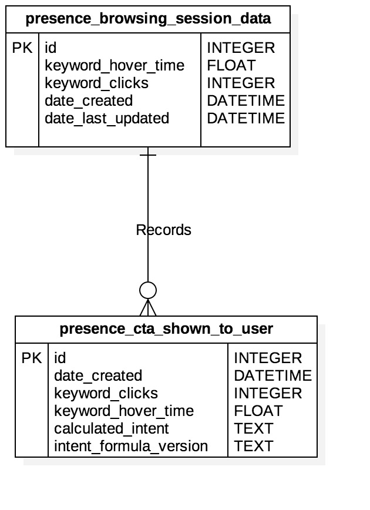

## CTA Shown To User WAMP Server API README - Presence Health
### The websocket uri for the WAMP server is: ws://patient-assist-backend.herokuapp.com/ws
### All WAMP components/enpoints are in the realm: patient_assist_realm



### IN DEVELOPMENT
## Procedure Endpoint: Create row in the presence_cta_shown_to_user table of the database
## URI: patient_assist_backend.presence_health.create_presence_cta_shown_to_user_record
    ```
    This procedure creates a new row in the presence_cta_shown_to_user table of the database and adds a many to
    one relationship to the presence_browsing_session_data row whose id field matches the given browsing_session_id parameter.
    
    Procedure uri: 'patient_assist_backend.presence_health.create_presence_cta_shown_to_user_record'
    
    :param args: Argument list. Accepts only one argument
                 [browsing_session_id]
                 browsing_session_id: (type: Integer) Database id of presence_browsing_session_data row to establish relation to.
      
    :return: Returns an object that has a property, kwargs. That property will have the following properties:
            id: (type: Integer) Database id of new presence_cta_shown_to_user row.
            browsing_session_id: (type: Integer) Database id of presence_browsing_session_data row that the new presence_cta_shown_to_user row is related to.
            date_created: (type: String) Date presence_cta_shown_to_user row was created in "YYYY-MM-DD" format
            keyword_clicks: (type: Integer) number of clicks corresponding to given keyword that was used to calculate the intent of this snapshot.
            keyword_hover_time: (type: Float) length of hover time corresponding to given keyword that was used to calculate the intent of this snapshot.
            calculated_intent: (type: String) Calculated intent keyword on the date this snapshot was created.
            intent_formula_version: (type: String) Version of the intent calculation formula used to calculate intent
    ```

- Example Javascript Call
    ```
    <!DOCTYPE html>
    <html>
       <body>
          <h1>Example Client Side Calls to Patient Assist Backend</h1>
          <p>Open JavaScript console to watch output.</p>
          <script src="https://autobahn.s3.amazonaws.com/autobahnjs/latest/autobahn.min.jgz"></script>
          <script>
          try {
               var autobahn = require('autobahn');
               var when = require('when');
            } catch (e) {
               // When running in browser, AutobahnJS will
               // be included without a module system
               var when = autobahn.when;
            }
            
            var wsuri = "ws://patient-assist-backend.herokuapp.com/ws";
            var connection = new autobahn.Connection({
                               url: wsuri,
                               realm: 'patient_assist_realm'}
                            );
                            
            connection.onopen = function (session) {
               var dl = [];
               var browsing_session_id = 1;
            
               dl.push(session.call('patient_assist_backend.presence_health.create_presence_cta_shown_to_user_record', [browsing_session_id]).then(
                  function (res) {
                     console.log("Result: db id:" + res.kwargs.id + 
                     ", browsing session id: " + res.kwargs.browsing_session_id +
                     ", date created: " + res.kwargs.date_created +
                     ", keyword_clicks: " + res.kwargs.keyword_clicks +
                     ", keyword_hover_time: " + res.kwargs.keyword_hover_time +
                     ", calculated_intent: " + res.kwargs.calculated_intent +
                     ", intent_formula_version: " + res.kwargs.intent_formula_version);
                  }
               ));
            
               when.all(dl).then(function () {
                  console.log("All finished.");
                  connection.close();
               });
            };
            
            connection.open();
          </script>
       </body>
    </html>
    ```

### IN DEVELOPMENT
## Procedure Endpoint: Read rows from presence_cta_shown_to_user table of the database
## URI: patient_assist_backend.presence_health.read_presence_cta_shown_to_user_records
    ```
    This procedure reads/queries the presence_cta_shown_to_user table of the database for rows whose id field of the related
    presence_browsing_session_data row matches the given id parameter.
    
    Procedure uri: 'patient_assist_backend.presence_health.read_presence_cta_shown_to_user_records'
    
    :param args: Argument list. Accepts only one argument
                 [browsing_session_id]
                 browsing_session_id: (type: Integer) Database id of related presence_browsing_session_data row.
      
    :return: Returns an object that has a property, kwargs. That property will have a property, data, which is an array.
    Each object in that array will have the following properties:
            id: (type: Integer) Database id of presence_cta_shown_to_user row.
            browsing_session_id: (type: Integer) Database id of presence_browsing_session_data row that this row is related to.
            date_created: (type: String) Date presence_cta_shown_to_user row was created in "YYYY-MM-DD" format
            keyword_clicks: (type: Integer) number of clicks corresponding to given keyword that was used to calculate the intent of this snapshot.
            keyword_hover_time: (type: Float) length of hover time corresponding to given keyword that was used to calculate the intent of this snapshot.
            calculated_intent: (type: String) Calculated intent keyword on the date this snapshot was created.
            intent_formula_version: (type: String) Version of the intent calculation formula used to calculate intent
    ```

- Example Javascript Call
    ```
    <!DOCTYPE html>
    <html>
       <body>
          <h1>Example Client Side Calls to Patient Assist Backend</h1>
          <p>Open JavaScript console to watch output.</p>
          <script src="https://autobahn.s3.amazonaws.com/autobahnjs/latest/autobahn.min.jgz"></script>
          <script>
          try {
               var autobahn = require('autobahn');
               var when = require('when');
            } catch (e) {
               // When running in browser, AutobahnJS will
               // be included without a module system
               var when = autobahn.when;
            }
            
            var wsuri = "ws://patient-assist-backend.herokuapp.com/ws";
            var connection = new autobahn.Connection({
                               url: wsuri,
                               realm: 'patient_assist_realm'}
                            );
                            
            connection.onopen = function (session) {
               var dl = [];
               var browsing_session_id = 1;
            
               dl.push(session.call('patient_assist_backend.presence_health.read_presence_cta_shown_to_user_records', [browsing_session_id]).then(
                  function (res) {
                     var results = res.kwargs.data;
                     
                     for (i = 0; i < results.length; i++){
                         var presence_cta_shown_to_user_row_object = results[i];
                         
                         console.log("Result: db id:" + presence_cta_shown_to_user_row_object.id + 
                         ", browsing session id: " + presence_cta_shown_to_user_row_object.browsing_session_id +
                         ", date created: " + presence_cta_shown_to_user_row_object.date_created +
                         ", keyword_clicks: " + presence_cta_shown_to_user_row_object.keyword_clicks +
                         ", keyword_hover_time: " + presence_cta_shown_to_user_row_object.keyword_hover_time +
                         ", calculated_intent: " + presence_cta_shown_to_user_row_object.calculated_intent +
                         ", intent_formula_version: " + presence_cta_shown_to_user_row_object.intent_formula_version);
                     }
                  }
               ));
            
               when.all(dl).then(function () {
                  console.log("All finished.");
                  connection.close();
               });
            };
            
            connection.open();
          </script>
       </body>
    </html>
    ```
