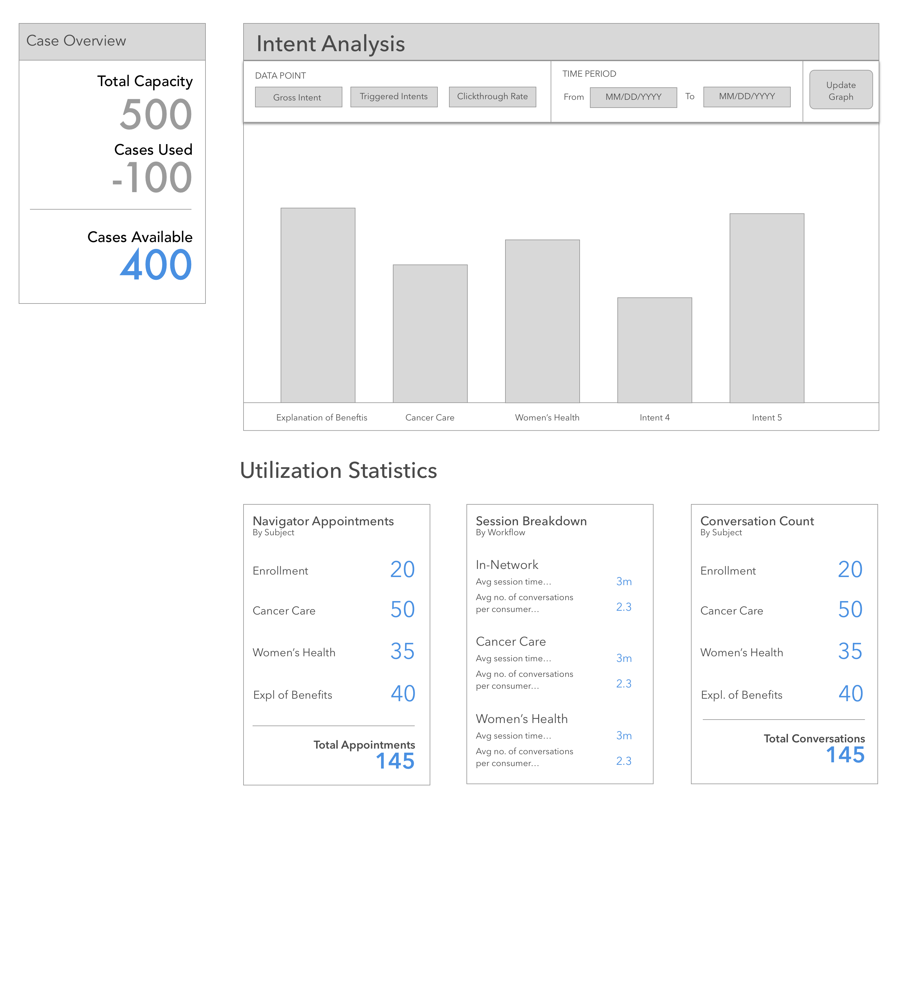

# Smart Help Desk Dashboard User Stories - Presence Health

## User Persona
- As Sally Stakeholder, a stakeholder at Presence Health, I can visit the Smart Help Desk application at some url to
view consumer intent, utilization, and capacity data collected by the patient assist plugin installed on the Presence
Health website.
    - Smart Help Desk application wireframe - Presence Health:
        

    ### Acceptance Stories
    - Acceptance stories for Sally Stakeholder

        #### Scenario 1: Sally Stakeholder does not have authorized login credentials and visits the Smart Help Desk URL.
        - When Sally Stakeholder visits the url for the Smart Help Desk Application without authorized login credentials,
        she is not allowed access to the Smart Help Desk Application. She is prompted to contact an admin at Care
        Advisors to obtain valid login credentials.
        
        #### Scenario 2: Sally Stakeholder has authorized login credentials and visits the Smart Help Desk URL.
        - When Sally Stakeholder visits the url for the Smart Help Desk Application with authorized login credentials,
        a webpage resembling the above wireframe is pulled up. She can interact with the buttons and view the data for
        the specified dates

## System Personae
- As the Smart Help Desk application, an HTTP server with login based user authentication, I provide a web based
Graphical User Interface (GUI) that allows Presence Health Stakeholders to view consumer intent, utilization, and
capacity data collected by the patient assist plugin installed on the Presence Health website. I obtain the intent,
utilization, and capacity data for the GUI from the HTTP REST endpoints provided by the Patient Assist Browsing Data
HTTP server.
    - Smart Help Desk application wireframe - Presence Health:
        

    ### Acceptance Stories
    - Acceptance stories for Smart Help Desk application.

        #### Scenario 1: Smart Help Desk is visited without authorized login credentials.
        - When the Smart Help Desk application is visited without authorized login credentials, the application redirects
        the user to a landing page that instructs the user to contact a Care Advisor admin to obtain valid login
        credentials.
        
        #### Scenario 1: Smart Help Desk is visited with authorized login credentials.
        - When the Smart Help Desk application is visited with authorized login credentials, the application makes GET
        requests to the following HTTP endpoints to obtain the data to populate the GUI.
        
            - HTTP REST Endpoint: Browsing Session Data - Presence Health (IN DEVELOPMENT)
                - [Browsing Session Data HTTP REST Endpoint README](../../backend_server_api_documentation/presence_health/HTTP_server_API/browsing_session_data_HTTP_REST_endpoint_README.md)
                - This HTTP endpoint provides the API to read/query from the Browsing Session Data Table for Presence Health.
                    - The Smart Help Desk application makes a request to this endpoint with parameters for the desired time
                    period and a parameter specifying to only include rows with relations to a conversation_workflow_snapshot
                    table row. The data is used as the numerator for the clickthrough rate, eg. browsing sessions that started a conversation.
                    The number of objects is totaled to obtain total cases. There is a key for total number of purchased
                    cases for this time period.
                    - The Smart Help Desk application makes another request to this endpoint with parameters for the desired time
                    period. The data is used as the denominator for the clickthrough rate, eg. total browsing sessions started
                    by the patient assist tool.
            
            - HTTP REST Endpoint: Browsing Intent Snapshot - Presence Health (IN DEVELOPMENT)
                - [Browsing Intent Snapshot HTTP REST Endpoint README](../../backend_server_api_documentation/presence_health/HTTP_server_API/browsing_intent_snapshot_HTTP_REST_endpoint_README.md)
                - This HTTP endpoint provides the API to read/query from the Browsing Intent Snapshot Table for Presence Health
                    - The Smart Help Desk application makes a request to this endpoint with parameters for the desired time
                    period. The objects are half of the data for the 'gross intent' button.
            
            - HTTP REST Endpoint: CTA Shown To User - Presence Health (IN DEVELOPMENT)
                - [CTA Shown To User HTTP REST Endpoint README](../../backend_server_api_documentation/presence_health/HTTP_server_API/cta_shown_to_user_HTTP_REST_endpoint_README.md)
                - This HTTP endpoint provides the API to read/query from the CTA Shown To User Table for Presence Health
                    - The Smart Help Desk application makes a request to this endpoint with parameters for the desired time
                    period. The objects are half of the data for the 'gross intent' button. The objects are also the data for the
                    'triggered intent' button.
            
            - HTTP REST Endpoint: Conversation Workflow Snapshot - Presence Health (IN DEVELOPMENT)
                - [Conversation Workflow Snapshot HTTP REST Endpoint README](../../backend_server_api_documentation/presence_health/HTTP_server_API/conversation_workflow_snapshot_HTTP_REST_endpoint_README.md)
                - This HTTP endpoint provides the API to read/query from the Conversation Workflow Snapshot Table for Presence Health.
                    - The Smart Help Desk application makes a request to this endpoint with parameters for the desired time
                    period. The objects are the data for the 'conversation count' box. The objects are also the data for the
                    'session breakdown' box.
            
            - HTTP REST Endpoint: Scheduled Appointment With Navigator - Presence Health (IN DEVELOPMENT)
                - [Scheduled Appointment With Navigator HTTP REST Endpoint README](../../backend_server_api_documentation/presence_health/HTTP_server_API/scheduled_appointment_with_navigator_HTTP_REST_endpoint_README.md)
                - This HTTP endpoint provides the API to read/query from the Scheduled Appointment With Navigator Table for Presence Health.
                    - The Smart Help Desk application makes a request to this endpoint with parameters for the desired time
                    period. The objects are the data for the 'navigator appointments' box.
        
- As the Patient Assist Browsing Data HTTP server, I provide RESTful HTTP endpoints that read browsing session and other 
related data collected from the patient assist plugin for Presence Health. These endpoints can be used to provide the 
data that the Smart Help Desk Application needs to populate its web based Graphical User Interface (GUI).
    - Patient Assist Browsing Data HTTP Server Documentation - Presence Health:
        - [Patient Assist Browsing Data HTTP Server Documentation - Presence Health](../../backend_server_api_documentation/presence_health/HTTP_server_API/index.md)